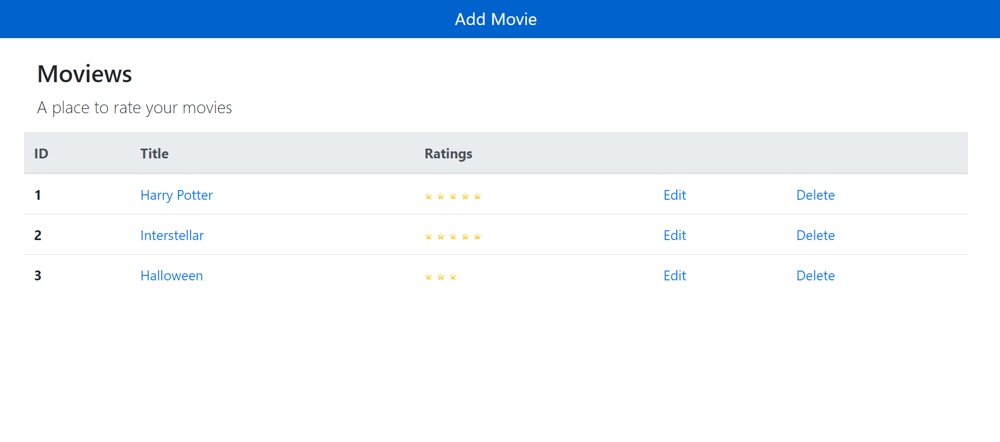
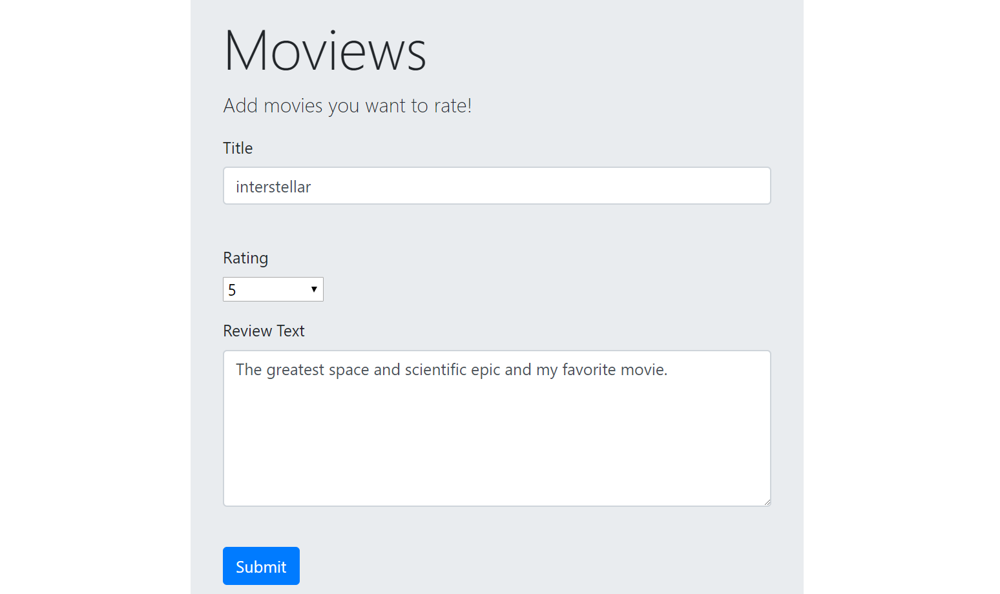

# MovieReview
This is a Flask web application that allows the user to view, create, update and remove movie reviews in a database. 

### Perequisite
Make sure you have the latest version of Python 3 installed on your computer

### Installing
<ul>
  <li> Clone this repo, open your terminal and direct to this local folder</li>
  <li> Make sure you have the latest Python 3 on your computer </li>
  <li> On Windows, type 
  
  ```
  $venv\Scripts\activate
  ```
  
  Then type: 
  ```
  $set FLASK_APP=server.py
  $python -m flask run
  ```
  
  On ios, type 
  ```
  $. venv/bin/activate
  ```
  Then type:
  ```
  $ export FLASK_APP=hello.py
  $ flask run
  ```
  </li>
  
  <li>Open your server and go to:
  
  ```
  127.0.0.1:5000
  ```
  
  </li>
  
</ul>

### Built With:
* Flask (http://flask.pocoo.org/docs/1.0/quickstart/) - the web framework
* Sqlachemy (https://www.sqlalchemy.org/) - the SQL toolkit
* Jinja (http://jinja.pocoo.org/docs/2.10/) - the templating engine

### Deployment 

* The Main Page 



* The edit review page. Note that this page shares the same template.



* If the user clicks on a movie title, a page is shown that contains the review text in addition to the title and the rating. The user can click a button or link to return to the list of reviews.
 
